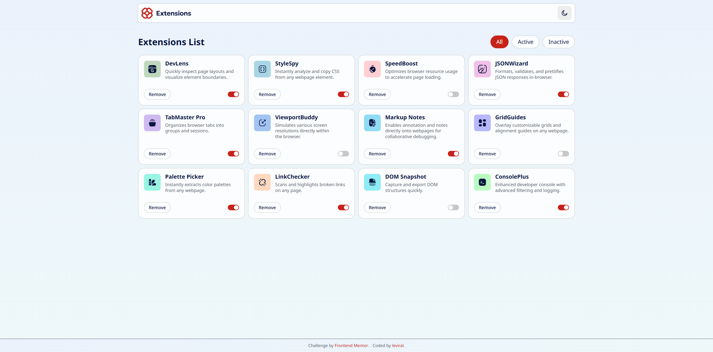
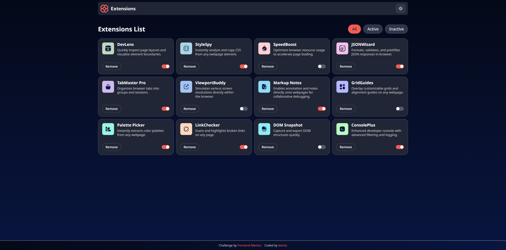
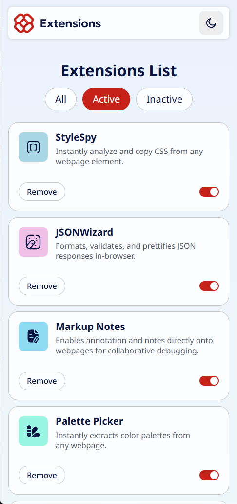
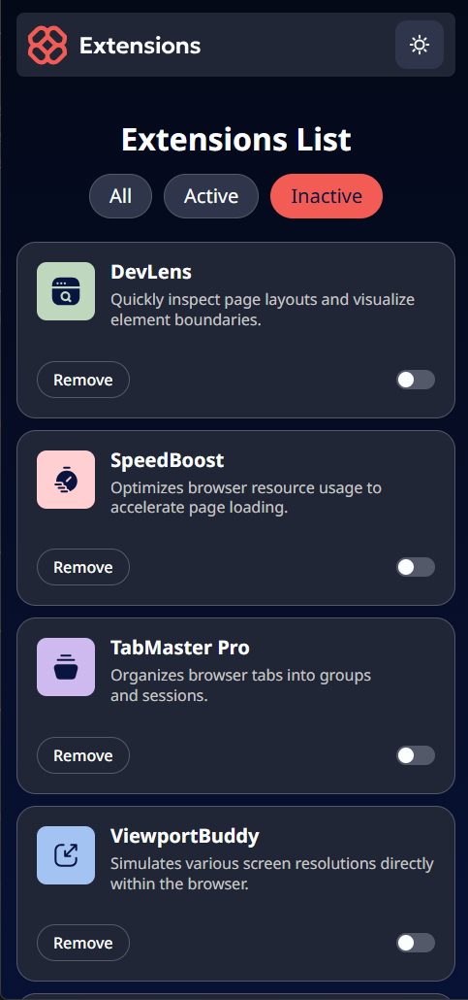

# Frontend Mentor - Browser extensions manager UI solution

This is a solution to
the [Browser extensions manager UI challenge on Frontend Mentor](https://www.frontendmentor.io/challenges/browser-extension-manager-ui-yNZnOfsMAp).
Frontend Mentor challenges help you improve your coding skills by building realistic projects.

## Table of contents

- [Overview](#overview)
    - [The challenge](#the-challenge)
    - [Screenshot](#screenshot)
    - [Links](#links)
- [My process](#my-process)
    - [Built with](#built-with)
    - [Features](#features)
    - [What I learned](#what-i-learned)
- [Author](#author)

## Overview

### The challenge

Users should be able to:

- Toggle extensions between active and inactive states
- Filter active and inactive extensions
- Remove extensions from the list
- Select their color theme
- View the optimal layout for the interface depending on their device's screen size
- See hover and focus states for all interactive elements on the page

### Screenshot

### Links

- Solution URL: [Frontend Mentor](https://www.frontendmentor.io/solutions/browser-extensions-dashboard-HsH8bX4RfT)
- Live Site URL: [Netlify](https://68d6e4468f2da3000871be14--starlit-eclair-f8a11c.netlify.app/)

## My process

### Built with

- Semantic HTML5 markup
- CSS custom properties
- Flexbox
- CSS Grid
- Mobile-first workflow
- JS

### Features

- Dynamic Data Rendering: Extensions are loaded from data.json and rendered into a responsive grid layout
- Light / Dark Mode: Theme switcher with smooth UI updates
- Extension Controls:
    - Toggle extension states (active/inactive)
    - Keyboard accessibility (toggle with Enter key)
    - Remove extensions from the dashboard
- Filtering System:
    - Show all, active, or inactive extensions dynamically
- Responsive Design: Layout adapts between desktop and mobile views

### What I learned

- Use event delegation and custom attributes (data-*) to manage UI states
- Implement accessibility features (keyboard interaction for toggles)
- Organize project logic into clear functions for rendering, filtering, and updating UI components
- Gain experience with light/dark theming using data-theme attributes

## Author

- GitHub - [leviral](https://github.com/leviral)
- Frontend Mentor - [@leviral](https://www.frontendmentor.io/profile/leviral)